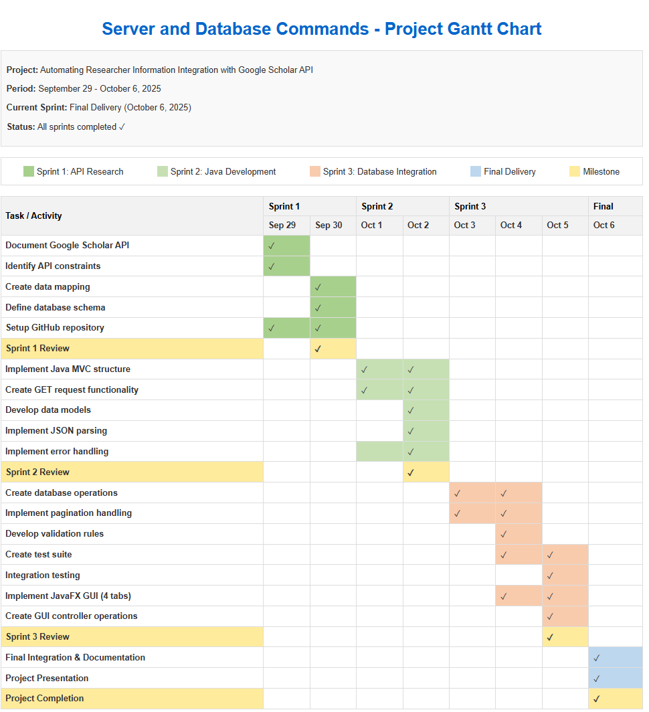

# Project Roadmap: Server and Database Commands

## 1. Objectives

### General Objective
To develop an automated system that integrates information from Google Scholar API about the institution's Top 3 researchers into the university's research database, improving data accuracy and reducing manual work.

### Specific Objectives
- Document the Google Scholar API functionality and requirements
- Develop Java code to retrieve researcher information via API
- Create a database integration system for the retrieved data
- Implement proper error handling and pagination for API calls
- Document all processes and code for future maintenance

## 2. Timeline and Milestones

| Sprint | Dates | Milestone | Status |
|--------|-------|-----------|--------|
| **Sprint 1** | Sep 29-30, 2025 | API Research & Documentation | Completed |
| **Sprint 2** | Oct 1-2, 2025 | Java Development for API Integration | In Progress |
| **Sprint 3** | Oct 3-5, 2025 | Database Integration & Testing | Not Started |
| **Final Delivery** | Oct 6, 2025 | Project Completion & Handover | Not Started |

## 3. Deliverables by Sprint

### Sprint 1: API Research & Documentation
- Technical report on Google Scholar API capabilities and limitations
- API endpoint documentation
- JSON response structure analysis
- Database mapping documentation
- GitHub repository setup with initial documentation

### Sprint 2: Java Development for API Integration
- Java classes implementing MVC pattern for API interaction
- GET request functionality for Google Scholar Author API
- Response parsing and data model implementation
- Unit tests for API functionality
- Code documentation and comments

### Sprint 3: Database Integration & Testing
- Database schema implementation
- Data mapping from API responses to database
- Implementation of pagination handling
- Error handling and logging
- Integration testing

### Final Delivery
- Complete integrated system
- User documentation
- Technical documentation
- Training materials
- Final presentation

## 4. Technologies and Tools

| Category | Tools/Technologies |
|----------|-------------------|
| **Version Control** | GitHub |
| **Programming Language** | Java |
| **API** | Google Scholar API |
| **Design Pattern** | Model-View-Controller (MVC) |
| **Documentation** | Markdown, LaTeX |
| **Database** | SQL (MySQL) |

## 5. Stakeholders

| Stakeholder | Role | Responsibilities |
|-------------|------|------------------|
| **Renata** | Project Leader | Overall project management, resource allocation, stakeholder communication |
| **Elizabeth** | Programmer | API integration, Java development, technical documentation |
| **Sandra** | Database Manager | Database design, database integration, data validation |
| **University Researchers** | End Users | Providing requirements, user acceptance testing |
| **Innovation Center Management** | Project Sponsor | Resource approval, high-level requirements |

## 6. Risk Management

| Risk | Probability | Impact | Mitigation Strategy |
|------|------------|--------|---------------------|
| Google Scholar API rate limiting | High | High | Implement proper request pacing, caching, and error handling |
| Changes to API structure | Medium | High | Build flexible parsers, implement regular API validation checks |
| Database integration issues | Medium | Medium | Early database mapping, thorough testing of data transformations |
| Time constraints | Medium | Medium | Prioritize features, maintain clear communication about scope |
| Data accuracy concerns | Medium | High | Implement validation rules, provide data reconciliation processes |
| Team availability conflicts | Low | Medium | Establish clear communication channels, document progress regularly |
| Security vulnerabilities | Low | High | Implement secure coding practices, conduct security review |

## 7. Communication Plan

- Daily stand-up meetings (15 minutes)
- Sprint planning at the beginning of each sprint
- Sprint review at the end of each sprint
- Documentation updates after each milestone
- GitHub issues for task tracking and discussion

## 8. Quality Assurance

- Code reviews for all pull requests
- Documentation review
- User acceptance testing for final delivery